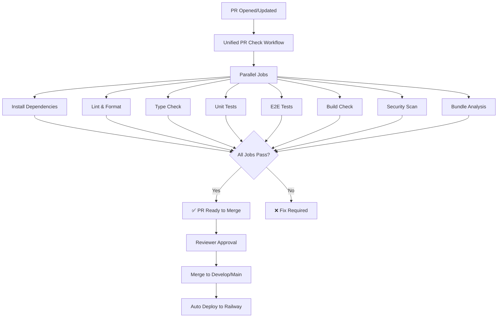

# CI/CD Automation Master Plan - MASH E-Commerce Platform

> **Goal:** Comprehensive automated PR checks ensuring code quality, build integrity, and deployment readiness

---

## Overview

- **Status:** In Progress
- **Owner:** MASH Development Team
- **Last Updated:** 2026-02-04

### Objectives

1. **100% Automated PR Validation** - No manual intervention required
2. **Zero Build Errors in Production** - Catch all issues before merge
3. **Fast Feedback Loop** - Results within 5-10 minutes
4. **Comprehensive Coverage** - Build, lint, type-check, unit tests, E2E tests

---

## Current State Analysis

### Existing Workflows

| Workflow | Trigger | Purpose | Status |
|----------|---------|---------|--------|
| `build.yml` | Push/PR to main, develop, TESTING-&-SECURITY | Production build validation | ✅ Active |
| `test.yml` | Push/PR to main, develop, TESTING-&-SECURITY | Unit tests + coverage | ✅ Active |
| `playwright-e2e.yml` | PR to main/master | E2E browser tests | ✅ Active |
| `deploy-railway.yml` | Push to main, develop | Railway deployment with pre-checks | ✅ Active |

### Identified Gaps

1. ❌ **No unified PR check workflow** - Checks scattered across multiple files
2. ❌ **Missing TypeScript strict checks** - Build uses `ignoreBuildErrors: true`
3. ❌ **No dependency security scanning** - Vulnerable packages not detected
4. ❌ **No bundle size monitoring** - Build size can grow unchecked
5. ❌ **Inconsistent environment variables** - Different workflows use different env vars
6. ❌ **No performance benchmarking** - Regression detection missing
7. ⚠️ **Limited test coverage enforcement** - 80% threshold exists but not enforced on all branches

---

## Implementation Plan

### Phase 1: Unified PR Check Workflow (Week 1)

**Goal:** Single comprehensive workflow that runs on every PR

#### Tasks

- [x] Create master PR check workflow (`pr-checks.yml`)
- [ ] Integrate all quality checks in parallel jobs
- [ ] Add required status checks in GitHub repo settings
- [ ] Test workflow on feature branch before main

#### Acceptance Criteria

- ✅ Single workflow file orchestrates all checks
- ✅ All jobs run in parallel for speed
- ✅ Clear pass/fail status visible in PR UI
- ✅ Workflow completes in < 10 minutes

### Phase 2: TypeScript Strict Mode Enforcement (Week 1-2)

**Goal:** Remove `ignoreBuildErrors: true` and fix all TypeScript errors

#### Tasks

- [ ] Audit all TypeScript errors (`npm run build`)
- [ ] Fix critical type errors (API types, component props)
- [ ] Remove `ignoreBuildErrors: true` from `next.config.js`
- [ ] Update workflow to enforce strict type checking

#### Acceptance Criteria

- ✅ `npm run build` passes with zero TypeScript errors
- ✅ `ignoreBuildErrors: false` in production config
- ✅ CI fails on any TypeScript error

### Phase 3: Security & Dependency Scanning (Week 2)

**Goal:** Detect vulnerable dependencies and security issues

#### Tasks

- [ ] Add `npm audit` check to workflow
- [ ] Integrate Dependabot for automated dependency updates
- [ ] Add CodeQL analysis for security vulnerabilities
- [ ] Create security policy (`SECURITY.md`)

#### Acceptance Criteria

- ✅ Automated vulnerability scanning on every PR
- ✅ Critical vulnerabilities block merge
- ✅ Weekly dependency update PRs from Dependabot

### Phase 4: Performance & Bundle Size Monitoring (Week 3)

**Goal:** Prevent bundle size regressions and performance issues

#### Tasks

- [ ] Add bundle size analysis action
- [ ] Set baseline bundle size limits
- [ ] Add Lighthouse CI for performance scoring
- [ ] Create performance budget enforcement

#### Acceptance Criteria

- ✅ Bundle size changes visible in PR comments
- ✅ Lighthouse scores (Performance, Accessibility, SEO) reported
- ✅ Merge blocked if bundle exceeds threshold

### Phase 5: Enhanced Test Coverage (Week 3-4)

**Goal:** Increase test coverage and enforce minimum thresholds

#### Tasks

- [ ] Audit current test coverage gaps
- [ ] Add missing unit tests for critical paths
- [ ] Enforce 80% coverage threshold globally
- [ ] Add visual regression tests with Playwright

#### Acceptance Criteria

- ✅ 80%+ line coverage enforced on all branches
- ✅ Coverage reports automatically posted to PRs
- ✅ Visual regression tests prevent UI bugs

### Phase 6: Deployment Protection (Week 4)

**Goal:** Ensure only validated code reaches production

#### Tasks

- [ ] Require all PR checks to pass before merge
- [ ] Add branch protection rules (main, develop)
- [ ] Require 1+ reviewer approval for main branch
- [ ] Add automatic rollback on deployment failure

#### Acceptance Criteria

- ✅ Main branch requires passing checks + approval
- ✅ Develop branch requires passing checks only
- ✅ Failed deployments auto-rollback to last stable version

---

## Workflow Architecture

### PR Check Pipeline



### Job Dependencies

```yaml
jobs:
  install:      # Job 1 - Cache dependencies
  lint:         # Job 2 - Depends on install
  typecheck:    # Job 2 - Depends on install
  test:         # Job 2 - Depends on install
  build:        # Job 3 - Depends on lint, typecheck
  e2e:          # Job 3 - Depends on build
  security:     # Job 2 - Depends on install (parallel)
  bundle-size:  # Job 3 - Depends on build
```

---

## Workflow Improvements

### 1. New Unified PR Check Workflow

**File:** `.github/workflows/pr-checks.yml`

**Features:**
- Runs on all PR events (open, sync, reopen)
- Parallel job execution for speed
- Comprehensive checks in single workflow
- Clear status reporting

**Jobs:**
1. **Setup** - Install dependencies, cache for other jobs
2. **Lint** - ESLint checks
3. **TypeCheck** - Strict TypeScript validation
4. **Unit Tests** - Jest with coverage reporting
5. **Build** - Production build validation
6. **E2E Tests** - Playwright browser tests
7. **Security Scan** - npm audit + CodeQL
8. **Bundle Analysis** - Size tracking and limits

### 2. Enhanced Build Workflow

**File:** `.github/workflows/build.yml` (Updated)

**Improvements:**
- Remove `ignoreBuildErrors` enforcement
- Add TypeScript strict mode validation
- Cache build artifacts for reuse
- Generate build performance report

### 3. Comprehensive Test Workflow

**File:** `.github/workflows/test.yml` (Updated)

**Improvements:**
- Run tests in parallel (unit, integration, E2E)
- Enforce 80% coverage threshold globally
- Upload coverage to Codecov
- Comment coverage diff on PRs

### 4. Security Scanning Workflow

**File:** `.github/workflows/security.yml` (New)

**Features:**
- npm audit for dependency vulnerabilities
- CodeQL for static analysis
- Dependabot integration
- SARIF report uploads

### 5. Performance Monitoring Workflow

**File:** `.github/workflows/performance.yml` (New)

**Features:**
- Bundle size tracking
- Lighthouse CI scores
- Performance budget enforcement
- Historical trend reporting

---

## Environment Variables Strategy

### Required for CI/CD

All workflows need these variables (stored as GitHub Secrets):

```yaml
# Backend API
NEXT_PUBLIC_API_URL

# Sanity CMS
NEXT_PUBLIC_SANITY_PROJECT_ID
NEXT_PUBLIC_SANITY_DATASET
NEXT_PUBLIC_SANITY_API_VERSION

# Firebase Auth
NEXT_PUBLIC_FIREBASE_API_KEY
NEXT_PUBLIC_FIREBASE_AUTH_DOMAIN
NEXT_PUBLIC_FIREBASE_PROJECT_ID
NEXT_PUBLIC_FIREBASE_STORAGE_BUCKET
NEXT_PUBLIC_FIREBASE_MESSAGING_SENDER_ID
NEXT_PUBLIC_FIREBASE_APP_ID

# Testing
CODECOV_TOKEN

# Railway Deployment
# No additional secrets required - Railway uses GitHub integration
# Deployments triggered automatically on push to main/develop branches
```

### Configuration Management

1. **GitHub Repository Secrets** - Store sensitive credentials
2. **Environment Files** - `.env.test` for test runs
3. **Default Values** - Fallback to safe defaults in workflows

---

## Branch Protection Rules

### Main Branch

- ✅ Require pull request before merging
- ✅ Require approvals: 1
- ✅ Require status checks to pass:
  - `lint`
  - `typecheck`
  - `test`
  - `build`
  - `e2e`
  - `security-scan`
- ✅ Require branches to be up to date
- ✅ Require conversation resolution before merging
- ❌ Allow force pushes (never)
- ❌ Allow deletions (never)

### Develop Branch

- ✅ Require pull request before merging
- ❌ Require approvals (optional for faster iteration)
- ✅ Require status checks to pass (same as main)
- ✅ Require branches to be up to date
- ❌ Allow force pushes (only for maintainers)

---

## Quality Gates

### Must Pass Before Merge

| Check | Threshold | Blocking |
|-------|-----------|----------|
| Build | 100% success | ✅ Yes |
| Lint | 0 errors | ✅ Yes |
| TypeScript | 0 errors | ✅ Yes |
| Unit Tests | Pass all | ✅ Yes |
| Coverage | ≥ 80% | ✅ Yes |
| E2E Tests | Pass all | ✅ Yes |
| Security Scan | 0 critical/high | ✅ Yes |
| Bundle Size | < 500KB increase | ⚠️ Warning |
| Lighthouse Performance | ≥ 80 | ⚠️ Warning |

---

## Success Metrics

### Performance KPIs

- **PR Check Duration:** < 10 minutes (target: 7 minutes)
- **Build Success Rate:** > 95%
- **Test Flakiness:** < 2% (E2E tests)
- **Coverage Trend:** +1% per month
- **Security Vulnerabilities:** 0 critical in production

### Developer Experience

- **Time to Feedback:** < 5 minutes (lint/type errors)
- **False Positive Rate:** < 5% (failed checks that were wrong)
- **Developer Satisfaction:** > 8/10 (quarterly survey)

---

## Rollback Plan

If CI/CD changes cause issues:

1. **Immediate:** Revert workflow file changes via git
2. **Bypass:** Temporarily disable specific checks in repo settings
3. **Communicate:** Notify team via Slack/Discord
4. **Fix Forward:** Address root cause and re-enable
5. **Document:** Add issue to prevent recurrence

### Emergency Bypass Procedure

```bash
# Disable specific check temporarily
gh api repos/MASH-Mushroom-Automation/MASH-Ecommerce-Web/branches/main/protection \
  --method PUT \
  --field required_status_checks[strict]=true \
  --field required_status_checks[contexts][]=[]
```

---

## Maintenance Schedule

### Daily
- Monitor workflow success rate
- Review failed check alerts

### Weekly
- Update Dependabot PRs
- Review coverage trends
- Check bundle size growth

### Monthly
- Audit GitHub Actions usage (free tier limits)
- Review and update security policies
- Performance benchmark comparison

### Quarterly
- Developer experience survey
- Workflow optimization review
- CI/CD cost analysis

---

## Resources & Documentation

### GitHub Actions Docs
- [Workflow Syntax](https://docs.github.com/en/actions/using-workflows/workflow-syntax-for-github-actions)
- [Branch Protection](https://docs.github.com/en/repositories/configuring-branches-and-merges-in-your-repository/managing-protected-branches)
- [Required Status Checks](https://docs.github.com/en/repositories/configuring-branches-and-merges-in-your-repository/managing-protected-branches/about-protected-branches#require-status-checks-before-merging)

### Testing Tools
- [Jest](https://jestjs.io/)
- [Playwright](https://playwright.dev/)
- [Codecov](https://about.codecov.io/)

### Security Tools
- [npm audit](https://docs.npmjs.com/cli/v8/commands/npm-audit)
- [CodeQL](https://codeql.github.com/)
- [Dependabot](https://docs.github.com/en/code-security/dependabot)

---

## Next Steps

1. **Review this plan** with team
2. **Create GitHub Project** for tracking tasks
3. **Implement Phase 1** (Unified PR workflow)
4. **Test on feature branch** before enforcing
5. **Roll out gradually** (develop → main)
6. **Monitor and iterate** based on feedback

---

**Status Legend:**
- ✅ Implemented
- ⚠️ In Progress
- ❌ Not Started
- 🔄 Needs Review
