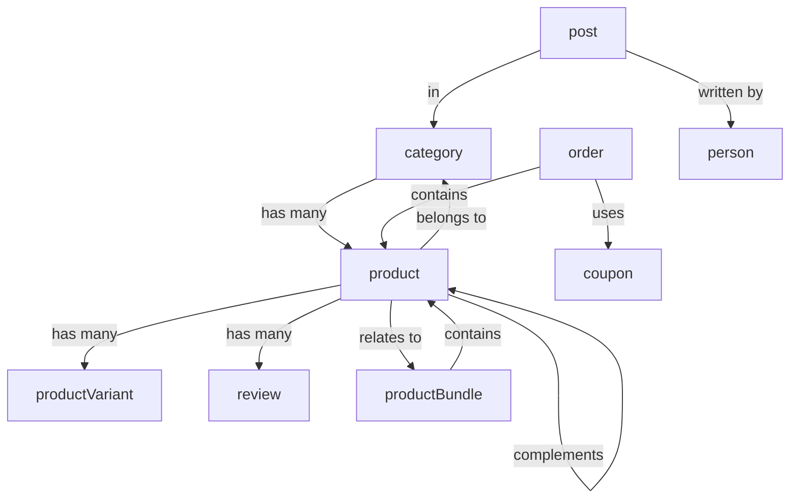

# 🏗️ Sanity CMS - Complete Schema Documentation

**Project**: PP_Namias (gerattrr)  
**Last Updated**: November 26, 2025  
**Total Document Types**: 17 (13 documents + 3 singletons + 4 objects)

---

## 📋 **TABLE OF CONTENTS**

1. [Schema Overview](#schema-overview)
2. [Core E-Commerce Schemas](#core-e-commerce-schemas)
3. [Content Management Schemas](#content-management-schemas)
4. [Marketing Schemas](#marketing-schemas)
5. [Singleton Schemas](#singleton-schemas)
6. [Object Schemas](#object-schemas)
7. [Schema Relationships](#schema-relationships)
8. [Field Reference](#field-reference)

---

## 📊 **SCHEMA OVERVIEW**

### **17 Document Types Organized by Purpose**

#### **🛒 Core E-Commerce (8 types)** - Product catalog and orders
- `category` - Product categories (3-level hierarchy)
- `product` - Main products (25+ fields, delivery options, variants)
- `productVariant` - Size/weight options
- `productBundle` - Product bundles with savings
- `review` - Customer reviews (ratings, verified purchase)
- `order` - Customer orders (status tracking, payment)
- `coupon` - Discount codes
- `promotion` - Marketing campaigns

#### **📝 Content Management (3 types)** - Website content
- `page` - CMS pages (About, Contact, FAQ)
- `post` - Blog posts (author, categories, SEO)
- `person` - Team members/authors

#### **📢 Marketing (2 types)** - Campaigns and analytics
- `emailCampaign` - Email marketing
- `analytics` - Reports and metrics

#### **⚙️ Singletons (3 types)** - Site-wide settings
- `settings` - Global site config
- `heroCarousel` - Homepage hero slider
- `featuredProducts` - Homepage featured section

#### **🧩 Objects (4 types)** - Reusable components
- `blockContent` - Rich text editor
- `infoSection` - Content blocks
- `callToAction` - CTA buttons
- `link` - Links

---

## 🛒 **CORE E-COMMERCE SCHEMAS**

### **1. `category` - Product Categories**

**Purpose**: Organize products into hierarchical categories

**Key Fields**:
```typescript
{
  _type: "category",
  name: string,                    // "Fresh Mushrooms"
  slug: { current: string },       // "fresh-mushrooms"
  description: blockContent,       // Rich text description
  image: image,                    // Category image
  parentCategory: reference,       // For subcategories
  isFeatured: boolean,             // Show on homepage
  isActive: boolean,               // Enable/disable
  sortOrder: number,               // Display order
  seoTitle: string,                // SEO meta title
  seoDescription: string,          // SEO meta description
  seoKeywords: string[]            // SEO keywords
}
```

**Current Data**: 3 categories
- Fresh Mushrooms (6 products)
- Dried Mushrooms (3 products)
- Growing Kits & Accessories (6 products)

**Relationships**:
- `product.category` → references `category`

---

### **2. `product` - Products**

**Purpose**: Main product catalog with full e-commerce features

**Key Fields** (25+ fields organized into 9 categories):

#### **Basic Info**:
```typescript
{
  name: string,                    // "Fresh Oyster Mushrooms"
  slug: { current: string },       // "fresh-oyster-mushrooms"
  description: blockContent,       // Rich product description
  shortDescription: string,        // For product cards
  image: image,                    // Main product image
  images: image[],                 // Gallery (2-4 images)
  category: reference,             // Link to category
  SKU: string,                     // "MUSH-OYS-001"
}
```

#### **Pricing**:
```typescript
{
  price: number,                   // ₱350
  isOnPromo: boolean,              // true/false
  promoType: string,               // "percentage" or "fixed"
  promoPercentage: number,         // 22 (for 22% off)
  promoPrice: number,              // ₱273 (auto-calculated)
  promoEndDate: datetime,          // Expiry date
  compareAtPrice: number,          // Original price
}
```

#### **Inventory**:
```typescript
{
  quantity: number,                // 150 (units in stock)
  lowStockThreshold: number,       // 20 (low stock alert)
  trackInventory: boolean,         // Enable/disable tracking
  allowBackorders: boolean,        // Allow out-of-stock orders
  stockStatus: string,             // "in-stock", "low-stock", "out-of-stock"
  stockHistory: array,             // Track changes
}
```

#### **Variants**:
```typescript
{
  hasVariants: boolean,            // Does product have variants?
  variants: reference[],           // Array of productVariant refs
  weight: number,                  // Default weight (grams)
  unit: string,                    // "grams", "kg", "piece"
}
```

#### **Smart Recommendations**:
```typescript
{
  suggestedProducts: reference[],          // "You May Also Like" (max 8)
  relatedProducts: reference[],            // Similar products
  complementaryProducts: reference[],      // "Frequently Bought Together" (max 4)
  relatedBundles: reference[],             // Package deals
  productTags: string[],                   // ["bestseller", "organic", "fresh"]
}
```

#### **Freshness & Quality**:
```typescript
{
  freshnessInfo: {
    harvestWindow: string,         // "Harvested within 24 hours"
    shelfLife: string,             // "5-7 days refrigerated"
    storageInstructions: text,     // How to store
    qualityIndicators: string[],   // ["firm texture", "no dark spots"]
  }
}
```

#### **Preparation**:
```typescript
{
  preparationInfo: {
    difficultyLevel: string,       // "beginner", "intermediate", "advanced"
    cookingTime: number,           // Minutes
    preparationTips: string[],     // Tips array
    recipeIdeas: array[],          // Recipe suggestions
  }
}
```

#### **Same-Day Delivery (Lalamove)**:
```typescript
{
  deliveryOptions: {
    sameDayDeliveryEligible: boolean,     // Can be delivered same-day?
    deliveryZones: string[],              // ["Metro Manila", "Quezon City"]
    perishable: boolean,                  // Requires cold transport?
  },
  deliveryWeight: {
    packageWeight: number,                // 0.5 (kg)
    packageDimensions: {
      length: number,                     // cm
      width: number,
      height: number,
    }
  }
}
```

#### **SEO & Discovery**:
```typescript
{
  searchKeywords: string[],        // ["oyster", "fresh", "mushroom"]
  nutritionalHighlights: array[],  // Nutrition facts
  isFeatured: boolean,             // Show on homepage?
}
```

**Current Data**: 15 products imported
- 6 fresh mushrooms
- 3 dried mushrooms
- 2 specialty products
- 4 growing kits

**Relationships**:
- `product.category` → `category`
- `product.variants` → `productVariant[]`
- `product.suggestedProducts` → `product[]`
- `product.complementaryProducts` → `product[]`
- `product.relatedBundles` → `productBundle[]`

---

### **3. `productVariant` - Product Variants**

**Purpose**: Size/weight/color options for products

**Key Fields**:
```typescript
{
  _type: "productVariant",
  name: string,                    // "Fresh Oyster Mushrooms - Small (250g)"
  slug: { current: string },       // "fresh-oyster-mushrooms-small-250g"
  product: reference,              // Link to parent product
  variantName: string,             // "Small (250g)"
  variantType: string,             // "Size", "Weight", "Color"
  variantValue: string,            // "Large (600g)", "250g Pack"
  SKU: string,                     // Unique SKU
  price: number,                   // Overrides product price
  compareAtPrice: number,          // Original price
  stock: number,                   // Stock for this variant
  lowStockThreshold: number,       // Low stock alert
  images: image[],                 // Variant-specific images
  isDefault: boolean,              // Default selection
  sortOrder: number,               // Display order
}
```

**Current Data**: 15 variants for 5 products
- Fresh Oyster: Small (250g), Medium (500g), Large (1kg)
- Fresh Shiitake: Small (200g), Medium (400g), Large (800g)
- Dried Shiitake: Small (50g), Medium (100g), Large (250g)
- Mushroom Powder: Small (100g), Medium (250g), Large (500g)
- Oyster Growing Kit: Small, Medium, Large

**Relationships**:
- `productVariant.product` → `product`
- `product.variants` → `productVariant[]`

---

### **4. `productBundle` - Product Bundles**

**Purpose**: Curated product packages with savings

**Key Fields**:
```typescript
{
  _type: "productBundle",
  bundleName: string,              // "Gourmet Fresh Starter Pack"
  slug: { current: string },       // "gourmet-fresh-starter-pack"
  description: text,               // Bundle benefits
  tagline: string,                 // "Save 20% when you buy together!"
  products: reference[],           // 2-10 product refs
  bundlePrice: number,             // ₱950
  discountPercentage: number,      // 15 (auto-calculated)
  savingsAmount: number,           // ₱150 (auto-calculated)
  image: image,                    // Bundle image
  images: image[],                 // Additional images
  isActive: boolean,               // Enable/disable
  availableFrom: datetime,         // Start date
  availableUntil: datetime,        // End date
  stockLimit: number,              // Max available (optional)
  isFeatured: boolean,             // Show on homepage
  badge: string,                   // "Best Value", "Limited Time"
  sortOrder: number,               // Display order
  seoTitle: string,                // SEO meta title
  seoDescription: string,          // SEO meta description
}
```

**Current Data**: 6 bundles
1. Gourmet Fresh Starter Pack (₱950, save ₱150)
2. Dried Collection Bundle (₱1440, save ₱360)
3. Health & Wellness Pack (₱2300, save ₱400)
4. Complete Growing Set (₱4500, save ₱800)
5. Ultimate Mushroom Collection (₱3500, save ₱700)
6. Beginner's Combo (₱1900, save ₱300)

**Relationships**:
- `productBundle.products` → `product[]`
- `product.relatedBundles` → `productBundle[]`

---

### **5. `review` - Product Reviews**

**Purpose**: Customer reviews with ratings and moderation

**Key Fields**:
```typescript
{
  _type: "review",
  product: reference,              // Product being reviewed
  customerName: string,            // "Juan Dela Cruz"
  customerEmail: string,           // "juan@example.com"
  rating: number,                  // 1-5 stars
  title: string,                   // "Fresh and delicious!"
  content: text,                   // Detailed review
  images: image[],                 // Customer photos
  verifiedPurchase: boolean,       // Actually purchased?
  status: string,                  // "pending", "approved", "rejected"
  helpfulVotes: number,            // Number of helpful votes
  reviewDate: datetime,            // When posted
  moderatedBy: reference,          // Admin who moderated
  moderatedAt: datetime,           // When moderated
}
```

**Current Data**: 45 reviews (3 per product)
- All pre-approved (status: "approved")
- All verified purchases
- Mix of 4-5 star ratings
- Mix of English and Filipino reviews

**Relationships**:
- `review.product` → `product`

---

### **6. `order` - Customer Orders**

**Purpose**: Order management and tracking

**Key Fields**:
```typescript
{
  _type: "order",
  orderNumber: string,             // "MASH-2025-0001"
  orderDate: datetime,             // When placed
  customerName: string,            // Full name
  customerEmail: string,           // Email
  customerPhone: string,           // Phone
  customerID: string,              // User ID from backend
  orderItems: array[],             // Products + quantities
  subtotal: number,                // Sum of items
  shippingFee: number,             // Delivery fee
  tax: number,                     // Tax amount
  discount: number,                // Discount applied
  totalAmount: number,             // Final total
  shippingAddress: object,         // Full address
  paymentMethod: string,           // Payment method
  paymentStatus: string,           // Payment status
  paymentReference: string,        // Transaction ID
  orderStatus: string,             // Order status
  statusHistory: array[],          // Status changes
  trackingNumber: string,          // Shipping tracking
  shippingCarrier: string,         // Delivery service
  estimatedDelivery: date,         // Expected delivery
  customerNotes: text,             // Special instructions
  internalNotes: text,             // Admin notes
  couponCode: string,              // Coupon used
  orderSource: string,             // Web, mobile, etc.
  isPriority: boolean,             // Priority order
}
```

**Current Data**: 0 (managed by backend API)

**Relationships**:
- `order.orderItems.product` → `product`
- `order.couponCode` → `coupon`

---

### **7. `coupon` - Discount Codes**

**Purpose**: Manage discount coupons

**Key Fields**:
```typescript
{
  _type: "coupon",
  code: string,                    // "SAVE20", "NEWUSER10"
  description: text,               // Internal description
  discountType: string,            // "percentage" or "fixed"
  discountValue: number,           // 20 (%) or 100 (₱)
  minPurchase: number,             // Minimum order total
  applicableProducts: reference[], // Specific products
  totalUsageLimit: number,         // Max uses (blank = unlimited)
  perCustomerLimit: number,        // Max per customer
  usageCount: number,              // Times used
  startDate: datetime,             // When active
  endDate: datetime,               // When expires
  isActive: boolean,               // Enable/disable
  isPublic: boolean,               // Show on website
  isCombinab le: boolean,          // Allow with other coupons
  eligibility: string,             // Customer eligibility
  source: string,                  // Distribution channel
  notes: text,                     // Internal notes
}
```

**Current Data**: 0 (managed by admin)

---

### **8. `promotion` - Marketing Campaigns**

**Purpose**: Site-wide promotions and sales

**Key Fields**:
```typescript
{
  _type: "promotion",
  name: string,                    // "Black Friday 2025"
  displayName: string,             // Public-facing name
  slug: { current: string },       // "black-friday-2025"
  tagline: string,                 // "Up to 50% OFF!"
  description: text,               // Detailed description
  bannerImage: image,              // Main banner (1920x600px)
  thumbnail: image,                // Small preview (400x400px)
  backgroundColor: string,         // Hex color
  textColor: string,               // Hex color
  type: string,                    // Promotion type
  discountType: string,            // "percentage" or "fixed"
  discountValue: number,           // Discount amount
  applicableTo: string,            // What it applies to
  startDate: datetime,             // Start
  endDate: datetime,               // End
  showOnHomepage: boolean,         // Display on homepage
  showOnProducts: boolean,         // Show badge on products
  priority: number,                // Display priority
  ctaText: string,                 // Button text
  ctaLink: string,                 // Button link
  isActive: boolean,               // Enable/disable
  isFeatured: boolean,             // Featured promotion
  impressions: number,             // Views
  clicks: number,                  // Clicks
  conversions: number,             // Orders
  termsConditions: text,           // Legal terms
  notes: text,                     // Internal notes
}
```

**Current Data**: 0 (managed by admin)

---

## 📝 **CONTENT MANAGEMENT SCHEMAS**

### **9. `page` - CMS Pages**

**Purpose**: Static pages (About, Contact, FAQ)

**Key Fields**:
```typescript
{
  _type: "page",
  name: string,                    // "About Us"
  slug: { current: string },       // "about"
  heading: string,                 // Page heading
  subheading: string,              // Subheading
  pageBuilder: array[],            // Flexible content blocks
  seoTitle: string,                // SEO meta title
  seoDescription: string,          // SEO meta description
}
```

---

### **10. `post` - Blog Posts**

**Purpose**: Blog articles with author and categories

**Key Fields**:
```typescript
{
  _type: "post",
  title: string,                   // Post title
  slug: { current: string },       // URL slug
  content: blockContent,           // Post content
  excerpt: text,                   // Short summary
  coverImage: image,               // Featured image
  publishDate: date,               // Publish date
  author: reference,               // Link to person
  category: reference,             // Link to category
  tags: string[],                  // Tags
  seoTitle: string,                // SEO meta title
  seoDescription: string,          // SEO meta description
}
```

---

### **11. `person` - Team Members/Authors**

**Purpose**: Team profiles and blog authors

**Key Fields**:
```typescript
{
  _type: "person",
  firstName: string,               // First name
  lastName: string,                // Last name
  picture: image,                  // Profile photo
  bio: blockContent,               // Biography
  role: string,                    // Job title
  email: string,                   // Contact email
  socialMedia: object,             // Social links
}
```

---

## 📢 **MARKETING SCHEMAS**

### **12. `emailCampaign` - Email Marketing**

**Purpose**: Manage email campaigns

**Key Fields**:
```typescript
{
  _type: "emailCampaign",
  name: string,                    // Campaign name
  subject: string,                 // Email subject
  preheader: string,               // Preview text
  type: string,                    // Campaign type
  content: blockContent,           // Email content
  plainText: text,                 // Plain text version
  ctaButtons: array[],             // CTA buttons
  featuredProducts: reference[],   // Products to showcase
  targetAudience: string,          // Target segment
  status: string,                  // Draft, sent, scheduled
  sentDate: datetime,              // When sent
  enableABTest: boolean,           // A/B testing
  fromName: string,                // Sender name
  replyTo: string,                 // Reply email
  recipients: number,              // Total recipients
  opens: number,                   // Open count
  uniqueOpens: number,             // Unique opens
  clicks: number,                  // Click count
  uniqueClicks: number,            // Unique clicks
  bounces: number,                 // Bounced emails
  unsubscribes: number,            // Unsubscribe count
  notes: text,                     // Internal notes
  tags: string[],                  // Tags
}
```

---

### **13. `analytics` - Reports**

**Purpose**: Analytics and reporting

**Key Fields**:
```typescript
{
  _type: "analytics",
  reportName: string,              // Report name
  reportType: string,              // Report type
  dateRange: object,               // Date range
  salesMetrics: object,            // Revenue, orders, AOV
  customerMetrics: object,         // New, returning, retention
  marketingMetrics: object,        // Campaigns, conversions
  topProducts: reference[],        // Best sellers
  generatedAt: datetime,           // When generated
  notes: text,                     // Notes
}
```

---

## ⚙️ **SINGLETON SCHEMAS**

### **14. `settings` - Site Settings**

**Purpose**: Global site configuration

**Key Fields**:
```typescript
{
  _type: "settings",
  title: string,                   // Site title
  description: text,               // Site description
  ogImage: image,                  // Social card image
  metadataBase: url,               // Base URL
  contactInfo: object,             // Contact details
  socialMedia: object,             // Social links
  businessHours: array[],          // Operating hours
  announcement: object,            // Site-wide announcement
}
```

---

### **15. `heroCarousel` - Hero Slider**

**Purpose**: Homepage hero carousel

**Key Fields**:
```typescript
{
  _type: "heroCarousel",
  slides: array[],                 // 3-5 hero slides
  autoplay: boolean,               // Auto-rotate
  interval: number,                // Seconds between slides
}
```

---

### **16. `featuredProducts` - Featured Section**

**Purpose**: Homepage featured products

**Key Fields**:
```typescript
{
  _type: "featuredProducts",
  sectionTitle: string,            // Section title
  sectionSubtitle: string,         // Subtitle
  products: reference[],           // 4-8 product refs
}
```

---

## 🧩 **OBJECT SCHEMAS**

### **17-20. Object Types**

**`blockContent`**: Rich text editor (portable text)  
**`infoSection`**: Reusable content blocks  
**`callToAction`**: CTA button components  
**`link`**: Link objects

---

## 🔗 **SCHEMA RELATIONSHIPS**



---

**Last Updated**: November 26, 2025  
**For Complete Guide**: See `.github/SANITY_MASTER_EXECUTION_PLAN.md`
